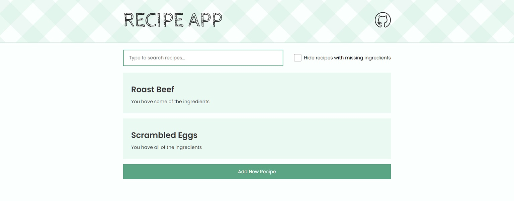

# Recipe App

This is an app that I built in response to a final project prompt that was given by a JavaScript course called [The Modern JavaScript Bootcamp](https://www.udemy.com/course/modern-javascript/).

The app can be accessed via here: [Recipe App Netlify link](https://relaxed-boyd-fa3545.netlify.app/).

## Stack

The tech stack of the app includes following technologies:
- HTML5
- CSS3
- JavaScript
- Browser APIs (Local Storage)

## Requirements

The project prompt included the following requirements:
- There should be a home page where users can see all recipes.
- In the home page:
  - Users should be able to filter recipes by text.
  - Users should be able to add a new recipe.
  - Users should be able to navigate to a recipe's details by clicking on it.
- There should be a recipe details page where users can see & edit details of a recipe.
  - Changes should be saved to Local Storage instantly, without requiring a save button.
  - Users should be able to add/remove ingredients to/from a recipe.
  - Users should be able to delete a recipe.